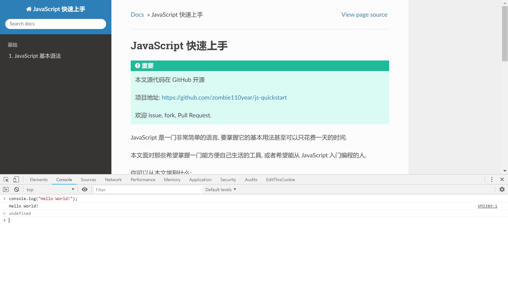

########################
JavaScript 基本语法
########################

.. |js| replace:: JavaScript

在浏览器中运行 |js| 代码
========================

所有的浏览器都可以作为一个 |js| 的 IDE 使用. 利用 开发者工具 中的 控制台(console), 你可以在浏览器中运行 |js| 代码.

Chrome 与 Firefox 都以 ctrl+shift+i 作为打开开发者工具的快捷键, 你可以切换至 console 标签, 一边阅读, 一边练习.



Hello World 起手
================

按照编程界的惯例, 让我们先在浏览器中输出一句 "Hello World!".

.. code-block:: javascript

    console.log("Hello World");
    // 这将在控制台中输出, 如果想要更炫酷一点, 你可以使用:

    alert("Hello World!!!!");
    // 弹窗

我们可以看到:

1. |js| 具有面对对象的特性, 比如, 第一条语句是调用了 ``console`` 对象的 ``log`` 方法.
#. |js| 语句末尾添加 ``;`` 分号, 实际上也可以不添加, 浏览器或其他 |js| 引擎在运行时会自动在行末添加分号. ``;`` 可以使你在同一行中执行多条语句. 采用哪种方案, 添加还是不加, 具体看所参与项目的代码风格要求以及个人习惯.
#. 使用 ``//`` 作为单行注释, 后面同一行内的输入不作为 |js| 语句执行. 也可以使用 ``/*``, ``*/`` 来进行多行注释.

当你在 控制台 中输入上述语句时, 应当可以看到浏览器有代码提示和自动补全 (按 Tab 键) 的功能.

声明变量
========

|js| 一般不需要在创建变量时对其进行声明, 并且, 在执行过程中也并不在意变量的类型, 这是 |js| 动态语言的特性.

但是, 为了减少程序的逻辑错误, 最好在一个语句块或函数的开头对用到的变量进行声明.

.. code-block:: javascript

    var x;              // x 是一个 xxxxx , 它将用来 xxxxxxxx
    var y = Number();
    z = Array();

以上都可以做为对变量的声明, 在声明的同时说明变量的类型与作用是一个好习惯.

语句的开头使用 ``var`` 关键字声明变量, 不使用 ``var`` 也是可以的. 不过需要注意的是, 不使用 ``var`` 声明的变量, 在创建时会被当做 **全局变量**, 在一个函数中使用这样的变量会造成逻辑上的错误, 因此, 建议在创建变量时都使用 ``var`` 声明.

``Number``, ``Array`` 都是 |js| 中的变量类型, 在后面加括号意味着调用了它们的 "实例化" 方法.

变量的类型
==========

|js| 中的变量有以下常用的类型:

- ``Number``    数字. |js| 没有其他语言中的 整数, 浮点数 等概念, 它们都是 "数字" 类型. 实际上, |js| 中只有浮点数, 是一个 64位的双精度浮点数, 在数字大小在 :math:`[-2^{53}+1, 2^{53}-1]` 之间时, 没有小数的浮点数和整数表现一致 [#不要使用位运算]_ .
- ``String``    字符串.
- ``Boolean``   布尔数, 只有 ``true`` 与 ``false`` 两个值.
- ``Array``     数组, |js| 中的数组不限定其中元素的类型, 可以是不同类的元素.

Number
------

|js| 中的 ``Number`` 是一个 64bit 的双精度浮点数, 在数字处于 :math:`[-2^{53}+1, 2^{53}-1]` 区间内时, 可以用它来模拟一个整数. 数字可以用以下 字面值 [#字面值]_ 表示.

.. code-block:: javascript

    var x;

    x = 123;        // 普通的整数表示法, 实际上是一个没有小数部分的浮点数
    x = -123.321;   // 小数表示法
    x = 3e8;        // 科学计数法, 3 是有效数字, 8 是数量级.
    x = 12.123e-3   // 数量级为负数时, 不需要添加括号. 就算前面的有效数字部分不规范也无妨, 会自动转换.
    // 上面的 12.123e-3 会转换为 1.2123e-2

    x = 3e8.8       //! 错误, 数量级只能用一个整数表示.

此外, 数字类型还有两个特殊的值:

.. code-block:: javascript

    NaN;            // 非数, 这个表示该值不能用数字表示
    Infinity;       // 该数字超出了浮点数的表示范围

数字的运算
~~~~~~~~~~

数字可以参与以下运算:

.. code-block:: javascript
    :caption: 四则运算

    var x = 123;
    var y = 2.12;

    x+y;        // 加法
    // 125.12

    x-y;        // 减法
    // 120.88

    x*y;        // 乘法
    // 260.76

    x/y;        // 除法
    // 58.0188679245283

    x%y;        // 求模
    // 0.03999999999999382
    // 浮点数的求模看起来有点令人困惑, 下面演示一下整数的求模

    63 % 10
    // 3
    // 求模可以认为是求余数

要在程序中得到整数结果, 可以调用内置的 ``Math`` 模块, 或者 ``parseInt`` 函数.

.. code-block:: javascript

    Math.round( 8 / 3 );        // 四舍五入
    // 3
    Math.round( 7 / 3 );
    // 2

    parseInt( 8 / 3 );          // 向下取整
    // 2

当然, 数字之间还可以进行大小的比较, 在之后的 `布尔数`_ 处详细讨论.

字符串
------

字符串 ( ``String`` ) 可以通过以下字面值 [#字面值]_ 表示:

.. code-block:: javascript

    var str;

    str = "这是一个字符串";

    str = '也可以用单引号表示';

字符串中的字符被引号包括, 引号本身并不是字符串的一部分.

如果要在字符串中包含引号, 可以用以下两种方法:

.. code-block:: javascript

    var str;

    str = '当外层用单引号, 内部可以使用"双引号", 反过来也是';

    str = "用反斜杠 \" \\ \" 将内部的引号转义吧";

字符串常用操作
~~~~~~~~~~~~~~

从字符串中提取子串
^^^^^^^^^^^^^^^^^^

.. code-block:: javascript

    var x = "0123456789";

    x[0];               // 使用下标提取目标位置的字符
    // "0"

    x.charAt(1);        // 调用 charAt 方法获得字符
    // "1"
    /**
     * charAt 方法, 需要输入索引值 index, 返回 index 位置的字符.
     * 和下标法几乎一样
     **/

    x.charCodeAt(2);    // 调用 charCodeAt 方法获得字符编码
    // 50
    /**
     * charCodeAt 输入索引 index, 返回 index 位置字符的编码值,
     * 返回它 Unicode 编码的十进制数字.
     **/

    x.slice(0, 8);      // 调用 slice 方法切片
    // "01234567"
    /**
     * slice 输入 start, end 一对索引, 返回这两者之间部分的切片.
     * 注意, 末尾不包含在内, 所以例子返回的是 "0"~"7", 而不是 "0"~"8"
     **/

如果索引越界, 虽然程序不会报错, 但是会返回 ``undefined``.

在字符串中按字符编码输入字符
^^^^^^^^^^^^^^^^^^^^^^^^^^^^

.. code-block:: javascript

    var str = "\x20, \u4f60\u597d"
    // " , 你好"

    /**
     * 可以使用 \x** 用十六进制输入 ASCII 字符
     * 也可以使用 \u**** 用十六进制输入 Unicode 字符
     **/

输入多行字符串
^^^^^^^^^^^^^^

可以使用 ``\n`` 转义换行符, 也可以使用反引号 ``\``` 替代普通的引号来作为字符串的标记, 这样, 可以在字符串中换行.

.. code-block:: javascript

    var str = `这是`
    一条
    跨越
    五行
    的字符串, 其中的换行符会保留`;`

模板字符串
^^^^^^^^^^

可以在用反引号包裹的字符串中使用 ``${var}`` 来将变量 ``var`` 的值嵌入到字符串中. 变量的数据类型会自动转换.

.. code-block:: javascript

    var name = "小明";
    var age = 10;
    var str = `班上的${name}同学今天 ${age} 岁了`;

    str;
    // "班上的小明同学今天 10 岁了"

转换大小写
^^^^^^^^^^

.. code-block:: javascript

    var str = "This is a WONDERFUL article!";

    str.toUpperCase();          // 全部转为大写
    // "THIS IS A WONDERFUL ARTICLE!"

    str.toLowerCase();          // 全部转为小写
    // "this is a wonderful article!"

查找字符字符串
^^^^^^^^^^^^^^

.. code-block:: javascript

    var str = "This is a WONDERFUL article!";

    str.includes("This");
    // true

    str.indexOf("is");
    // 2
    // 这其实是 "This" 中的 "is"

- ``includes`` 方法会判断 ``str`` 中是否包含输入的字符/字符串.
- ``indexOf`` 则返回第一次出现输入字符串的索引.

替换字符串的一部分
^^^^^^^^^^^^^^^^^^

.. code-block:: javascript

    var str = "This is a WONDERFUL article!";

    str.replace("is", "not is");
    // "Thnot is is a WONDERFUL article!"
    // 只会替换第一个搜索到的字符串

布尔数
------

布尔数 ( ``Boolean`` ) 只有两个值, ``true`` 或 ``false``, 它们可以用字面值写出来, 也可以通过布尔运算得到.

``<`` , ``>`` , ``>=`` , ``<=`` , ``==`` , ``===`` 等运算符, 用于比较两个数字的大小关系, 它们的作用分别是 小于, 大于, 大于等于, 小于等于, 等于, 等于.

值得一提的是这个 ``===`` 三联等号, 在其他语言中, 是没有这个运算符的, 在 |js| 中, 这个符号用来表示 "不自动类型转换进行比较".

.. code-block:: javascript
    :caption: 演示跨类型比较

    var x = 123;
    var y = '123';

    /**
     * x, y 分别是数字与字符串, 但是, 当数字与字符串比较时,
     * 会将字符串解析为对应的数字字面值, 因此, 你会得到以下结果:
     **/

    x == y;
    // true

    x === y;
    // false

所以, 为了避免歧义, 在通常情况下(没有跨类型比较的需求), 都应当使用 ``===`` 三联等号.

对于 Number 类中的那两个特殊的数字 ``NaN``, ``Infinity``, 它们也可以参与比较.

.. code-block:: javascript

    /* Infinity 被作为 正无穷看待 */
    0 < Infinity;
    // true

    0 > Infinity;
    // false

    0 > -Infinity;
    // true

    /* NaN 和任何数字比较的结果都是 false, 包括它自身 */
    0 < NaN;
    // false

    NaN == NaN;
    // false

    /* 要判断一个对象是否为 NaN, 只能调用 isNaN() 函数 */
    isNaN(NaN);
    // true

.. code-block:: javascript
    :caption: 布尔运算

    // 且(AND) 关系
    true && true === true;
    true && false === false;
    false && false === false;

    // 或(OR) 关系
    true || true === true;
    true || false === false;
    false || false === false;

    // 非(NOT) 关系
    ! true === false;
    ! false === true;

数组
----

数组 ``Array`` 可以包含任意类型的对象, 数字, 字符串 ... 甚至嵌套一个数组, 都可以. 数组可以用 ``[]`` 来表示:

.. code-block:: javascript

    var x = [1, '2', [3]];
    //[1, "2", Array(1)]

    var y = Array(1, '2', [3]);
    //[1, "2", Array(1)]

    /* 以上两者是一样的 */

数组本身是有序的, 其中的元素不一定是唯一的, 可以重复. 并且, 其长度可以随时扩展或缩短.

数组常用操作
~~~~~~~~~~~~

获取元素
^^^^^^^^

.. code-block:: javascript

    var a = [0, 1, 2, 3, 4, 5, 6, 7, 8, 9];

    a[0];
    // 0

    a.slice(0, 8);
    // [0, 1, 2, 3, 4, 5, 6, 7]

修改元素
^^^^^^^^

请注意, 如果通过索引为数组中元素赋值时, 下标越界, 那么会导致数组长度发生变化. 同样以上面的数组 ``a`` 举例

.. code-block:: javascript

    var a = [0, 1, 2, 3, 4, 5, 6, 7, 8, 9];

    a.length;
    // 10

    a[100] = 101;

    a.length;
    // 101

    a;
    // [0, 1, 2, 3, 4, 5, 6, 7, 8, 9, empty × 90, 101]
    // 其中 a[10] ~ a[99] 都是 undefined

因此, 一般不要直接按索引修改数组, 而是调用数组的方法

.. code-block:: javascript

    var a = [0, 1];

    a.push(2,3);     // 向数组的末尾添加 11, 12 两个元素, 可以添加更多.
    // 4        返回数组的新长度

    a.pop();            // 删除数组末尾的元素, 返回被删除的元素.
    // 3

    a.unshift(-2, -1);   // 在数组的头部插入若干元素.
    // 5        返回数组的新长度

    a.shift();          // 删除数组头部的元素, 返回被删除的元素.
    // -2

另外, 再介绍以下数组的 ``splice`` 方法, 这个方法会把数组删除一段并添加一段.

.. code-block:: javascript

    var a = [0, 1, 2, 3, 4, 5, 6, 7];

    /**
     * Array.splice(start, count, *pushs);
     *
     * 从 start 开始删除 count 个元素;
     * pushs 是添加的元素, 可以为多个. 在 start 处添加.
     **/
    a.splice(2, 2, '2','3');
    // [2, 3]           返回被删除的部分

    a
    // [0, 1, "2", "3", 4, 5, 6, 7]

查询元素
^^^^^^^^

.. code-block:: javascript

    var a = [1, 2, 3, 4, 3];

    a.indexOf(3);       // 查询目标第一次出现的索引
    // 2

合并数组
^^^^^^^^

使用 ``concat`` 方法. 新的部分被加在后面并返回. 注意, 返回的是一个新的数组, 旧的数组并没有被改变.

.. code-block:: javascript

    var a = [0, 1, 2, 3];
    var b = [4, 5, 6 ,7];

    a.concat(b);
    // [0, 1, 2, 3, 4, 5, 6, 7]

    b.concat(a);
    // [4, 5, 6, 7, 0, 1, 2, 3]

join
^^^^

``join`` 方法是将数组中的元素以指定字符串间隔, 返回一个字符串.

.. code-block:: javascript

    var a = [1,2,3];

    a.join('--');
    // "1--2--3"

排序
^^^^

数组内置了 ``sort`` 方法, 会按照默认的顺序排序, 如果要修改这个顺序, 需要自己编写一个排序函数, 覆盖原本的方法.

.. code-block:: javascript

    var a = [2, 1, 0, 3, 7, 9];
    var b = ['a', 'bc', 'cb', '中', '汉啊', '12', '啊', '汉中', 99];

    a.sort();
    // [0, 1, 2, 3, 7, 9]

    b.sort();
    // ["12", 99, "a", "bc", "cb", "中", "啊", "汉中", "汉啊"]

对于数字, 是按照从小到大的顺序排列. 对于有字符参与的数组, 是按照它们的 Unicode 码的顺序依次从小到大排列. 其中, 类似于 ``"12"`` 这样的数字字符串比较特殊, 是等同于字面上的数字来排序的.

对象
----

|js| 中的对象是一组 "键:值" 对组成的集合, 用 ``{}`` 花括号包括, 就像下面一样:

.. code-block:: javascript

    var github = {
        domain: "github.com",
        name: "GitHub",
        tag: ["program", "open source", "世界上最大的同♂性交友网站"]
    };

对象的属性, 也就是上例中的 ``domain``, ``name`` 不可以重复, 是唯一的, 在后面再次出现的重复键, 会将之前的值覆盖.

对象属性对应的值, 可以是任何类型, 基础类型或其他对象都是允许的.

数组的键其实是字符串, 当这个字符串符合变量名的规则, 就可以不用引号. 但是, 当该字符串中包含了相对变量名非法的字符, 例如 ``-``, ``+`` 等用作了操作符的字符, 就必须使用引号 ``na+me: "GitHub"``, 并且, 也不能使用 ``github.na+me`` 这样的方式访问它了, 需要使用 ``github['na+me']``

对象常用操作
~~~~~~~~~~~~

修改属性的值
^^^^^^^^^^^^

.. code-block:: javascript

    var github = {
        domain: "github.com",
        name: "GitHub",
        tag: ["program", "open source", "世界上最大的同♂性交友网站"]
    };

    github.domain = "https://github.com";

    github;     // 在交互式界面查看该对象

    // {domain: "https://github.com", name: "GitHub", tag: Array(3)}

复制一个对象
^^^^^^^^^^^^

复制一个对象, 需要使用 ``new`` 关键字, 否则, 只是添加了一个引用.

.. code-block:: javascript

    var github = {
        domain: "github.com",
        name: "GitHub",
        tag: ["program", "open source", "世界上最大的同♂性交友网站"]
    };

    /**
     * 不使用 new 关键字
     * 可以看到, 修改了 bilibili, github 也改变了
     * 这说明, bilibili 与 github 指向的是同一个对象.
     **/

    var bilibili = github;
    bilibili.name = "Bilibili";

    // 查看 bilibili 与 github 的属性

    bilibili;
    // {domain: "github.com", name: "Bilibili", tag: Array(3)}

    github;
    // {domain: "github.com", name: "Bilibili", tag: Array(3)}

    /**
     * 使用 new 关键字
     * 这会将原有的对象复制一份赋值给新的变量
     **/

     var bilibili = new github;
    bilibili.name = "Bilibili";

    // 查看 bilibili 与 github 的属性

    bilibili;
    // {domain: "github.com", name: "Bilibili", tag: Array(3)}

    github;
    // {domain: "github.com", name: "github", tag: Array(3)}

查询一个属性
^^^^^^^^^^^^

.. code-block:: javascript

    var github = {
        domain: "github.com",
        name: "GitHub",
        tag: ["program", "open source", "世界上最大的同♂性交友网站"]
    };

    /* 使用 in 关键字 */

    "name" in github;
    // true

    /**
     * 需要注意, 由于所有对象都会继承基类 object,
     * 而 in 关键字并不区分该对象自己的或者继承的.
     *
     * 如果要查询一个该对象并非继承得来的属性, 需要使用它的 hasOwnProperty 方法.
     **/

    github.hasOwnProperty("name");
    // true
    github.hasOwnProperty("toString");
    // false

Map与Set
--------

``Map`` 和 对象 一样, 都是 "键:值" 对的无序组合, 不过, ``Map`` 中的键可以是任意不可变类型的数据, 而对象只能是字符串.

``Set`` 则是没有值, 只储存了键的 ``Map``.

可以用以下办法初始化它们.

.. code-block:: javascript

    var m = new Map();
    var s = new Set();
    // 初始化空的 Map/Set

    var m = new Map(
        [
            [键, 值], [键, 值], [键, 值], ...
        ]
    );
    var s = new Set([元素, 元素, 元素, ...]);
    // 初始化时赋值.

初始化 ``Map`` 时, 其中的每一个键值对都需要一个二维数组来表示, 其中的一组键值对用一个二元数组表示.

常用操作
~~~~~~~~

添加/删除元素
^^^^^^^^^^^^^

.. code-block:: javascript

    var m = new Map();
    var s = new Set();

    /* 设置/添加元素 */
    m.set("0", 48);             // 如果已存在, 则覆盖
    // Map(1) {"0" => 48}       返回当前的 Map

    s.add("0");
    // Set(1) {"0"}             返回当前的 Set

    /* 删除元素 */
    m.delete("0");
    // true             如果成功(删除前存在该键) 则返回 true, 否则返回 false

    s.delete("0");
    // true             如果成功(删除前存在该键) 则返回 true, 否则返回 false

    /* 清空元素 */
    m.clear();
    s.clear();
    // 返回 undefined

查询元素
^^^^^^^^

.. code-block:: javascript

    var m = new Map(["0", 0], ["1", 1]);
    var s = new Set("0", "1");

    m.has("0");
    // true             查询是否包含键
    s.has("0");
    // true             查询是否包含元素

    m.get("0");
    // 0                获取键对应的值

iterable
--------

``iterable`` 是 ``Array``, ``Map``, ``Set`` 的基类.

控制结构
========

C, C++, Java 的控制结构语法 |js| 都可以使用, |js| 相比前三者, 多了一个 ``for in`` 语法.

条件判断
--------

.. code-block:: javascript

    if(  ) {

    } else {

    }

循环
----

.. code-block:: javascript

    for (var i = 0; i < 100; i++) {

    }

    for (var key in iter) {

    }

    for (var value of iter) {

    }

    while () {

    }

    do {

    } while ()

1.  推荐在循环对象属性的时候，使用 ``for...in``,
    在遍历数组的时候的时候使用 ``for...of`` .
#.  ``for...in`` 循环出的是 key, ``for...of`` 循环出的是 value
#.  ``for...of`` 是 ES6 新引入的特性. 修复了 ES5 引入的 ``for...in`` 的不足
#.  ``for...of`` 不能循环普通的对象, 需要通过和 ``Object.keys()`` 搭配使用

以上参考自 https://github.com/wujunchuan/wujunchuan.github.io/issues/11

break 与 continue
-----------------

- ``break`` 中断本次循环/判断
- ``continue`` 从当前位置中断, 进入下一次循环

.. [#不要使用位运算] 参考 http://jerryzou.com/posts/do-you-really-want-use-bit-operators-in-JavaScript/
.. [#字面值] 字面值, 是直接书写在代码中的数据,
    它们将以各自的格式被 解释器/编译器 解析为对应的数据类型.
