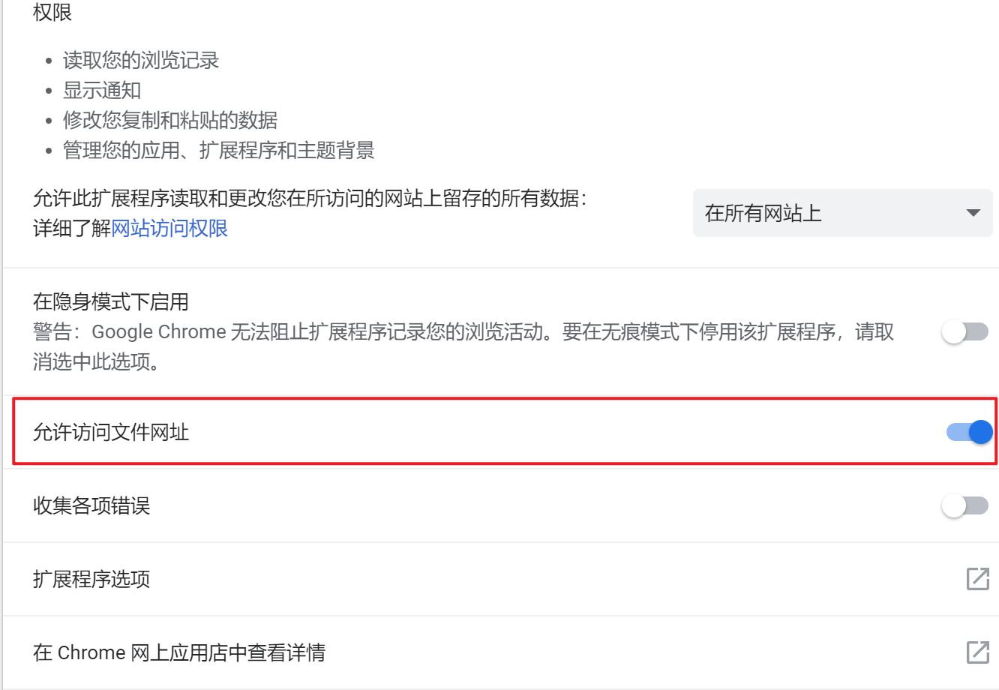

##################################
使用 TamperMonkey 插件管理用户脚本
##################################

添加自己编写的新脚本
====================

.. image:: _images/tampermonkey.addnew.png
    :align: center

在某个页面调出 TamperMonkey 的菜单, 按下 "添加新脚本" 便会自动创建一个模板, 其内容如下:

.. code-block:: javascript
    :caption: TamperMonkey 模板

    // ==UserScript==
    // @name         New Userscript
    // @namespace    http://tampermonkey.net/
    // @version      0.1
    // @description  try to take over the world!
    // @author       You
    // @match        http://*/*
    // @grant        none
    // ==/UserScript==

    (function() {
        'use strict';

        // Your code here...
    })();

其中,

.. code-block:: javascript

    // ==UserScript==
    // @name         New Userscript
    // @namespace    http://tampermonkey.net/
    // @version      0.1
    // @description  try to take over the world!
    // @author       You
    // @match        http://*/*
    // @grant        none
    // ==/UserScript==

部分有特殊含义, 是 TamperMonkey 会读取并解析的部分. 可以在这里对脚本进行一些设置. 其含义参见 `
UserScript 设置的详细文档`_ .

接下来的

.. code-block:: javascript

    (function() {
        'use strict';

        // Your code here...
    })();

其实是定义了一个匿名函数并调用它, 可以认为这是该脚本的主函数.

你可在该文件的其他地方定义其他的函数, 并在这里调用它.

如果给它定义一个名字, 应该更好理解:

.. code-block:: javascript

    function main() {
        'use strict'
        // Your code here
    }
    main();

为什么不在脚本中直接运行代码, 而是在一个函数中运行? 是为了限制变量的作用域, 让 ``window`` 对象干净一点.

运行脚本的方式
==============

当脚本保存并启用时, 每次访问一个网址, TamperMonkey 都会检测是否存在用户脚本能够匹配该网址 ( ``@match`` 参数), 如果能够匹配, 那么就会执行对应的脚本.

对 TamperMonkey 进行一些设置
============================

允许链接本地文件系统中的脚本
----------------------------

需要在 Chrome 的扩展程序设置中设置 "允许访问文件网址" ( FireFox 的设置界面我没找到...)

这样, 才能在脚本中 ``@require`` 本地的脚本文件.

.. code-block:: javascript

    // @require file:///D:/js/example.js

    // @require file///home/user/js/example.js

以上一个用于 Windows NT 系统, 一个用于类 Unix 系统.

UserScript 设置的详细文档
=========================

默认模板:

- ``@name`` 是该脚本的名称
- ``@namespace`` 为了避免与大量其他脚本或网站本身的 js 发生冲突而设置. 其实可以设置为任何值, 一般改成具有自己独特标志的值, 比如自己的个人网站, 博客的网址, 网名等等.
- ``@version`` 版本号, 需要手动更新. 程序的版本号修改最好能遵守 `规范 <https://semver.org/lang/zh-CN/>`_. TamperMonkey 会通过检查此项值的变化来控制自动更新.
- ``@description`` 描述
- ``@author`` 作者名
- ``@match`` 这是一个重要的设置, 用通配符表示该脚本在哪些网址上运行. 当网址能够匹配这个通配符表达式时, TamperMonkey 会运行该脚本.
- ``@grant`` 启用一些 ``GM_*`` 函数与一些出于安全考虑而默认禁用的功能.

也可以在其中添加一些额外的设置:

- ``@require`` 该脚本需要引用的包, 效果等同于
- ``@updateURL`` 检查更新的网址
- ``@downloadURL`` 下载更新的网址, 需要具体到文件.
- ``@supportURL`` 报告问题的网址
- ``@include`` 每行一个, 为当前脚本生效网址, 支持通配符
- ``@exclude`` 每行一个, 为当前脚本不生效网址, 支持通配符
- ``@resource`` 预加载资源
- ``@run-at`` 定义脚本运行的触发器
    - ``document-start`` 首先加载
    - ``document-body`` 当 html 中存在 body 元素时加载
    - ``document-end`` 当 DOMContentLoaded [#DOMContentLoaded]_ 事件触发的同时, 脚本加载
    - ``document-idle`` 当 DOMContentLoaded 事件触发后, 脚本加载, 这是默认值
    - ``context-menu`` 只有在 TamperMonkey 的菜单中点击才会加载, 这会忽略 ``@include``, ``@exclude``, ``@match`` 的设置. 但是在之后的版本可能会改变该设置的行为
- ``@noframes`` 脚本在主页面上运, 但不会在 ``<iframe />`` 中运行
- ``@nocompat`` 禁用代码优化, 保证兼容性.

.. [#DOMContentLoaded] https://developer.mozilla.org/en-US/docs/Web/Events/DOMContentLoaded